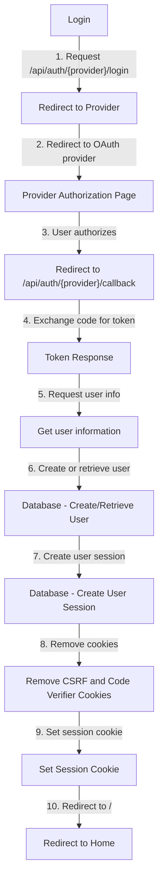
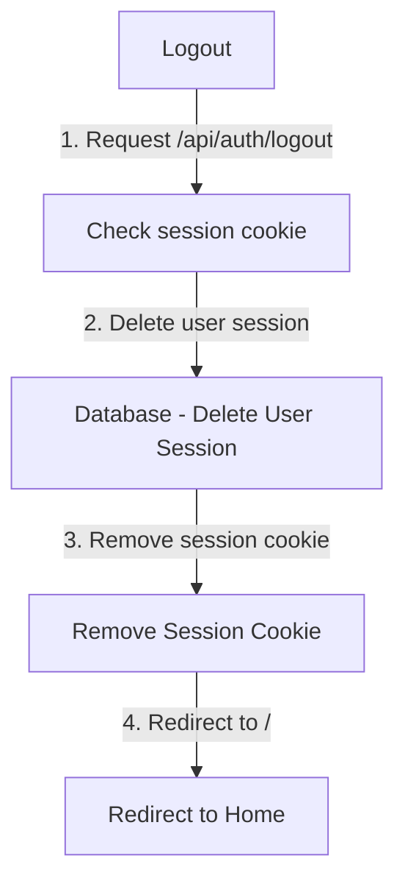

# Axum OAuth Sample

An axum example of authentication using oauth.

<https://github.com/Neo-Ciber94/axum-oauth-sample/assets/7119315/340580d2-c221-4f09-82f0-f343b50d4b96>

This example uses:

- Axum
- Askama
- Sqlx **(with SQlite)**
- TailwindCSS

And have oauth authentication for these providers:

- Google
- Github
- Discord

## Missing features

- Refresh tokens
- Token revocation

## How to run

### Prerequisites

- [node >= 18](https://nodejs.org/en)
- [sqlx-cli](https://crates.io/crates/sqlx-cli)

1. Install dependencies

```bash
cargo install
pnpm install # Or remove pnpm-lock.yaml and run `npm install`
```

2. Create database and run migrations

```bash
mkdir data
sqlx database create
sqlx migrate run
```

3. Run

```bash
npm run tw:watch
cargo run # In other shell
```

## Docker

Build the image:

```bash
docker build . -t axum-oauth
```

```bash
docker run -dp 5000:5000 -e HOST="0.0.0.0" -e PORT=5000 -e BASE_URL="http://localhost:5000" --env-file=.env.docker axum-oauth
```

> This require create a `.env.docker` file with similar to `.env.sample`

## Authentication workflow

### Login



### Logout


