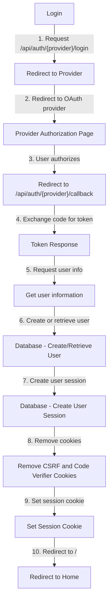
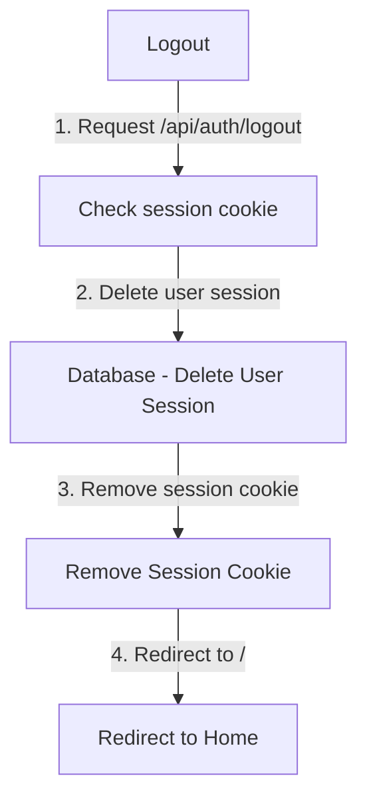

# Axum OAuth Sample

An axum example of authentication using oauth.

This example uses:

- Axum
- Askama
- Sqlx **(with SQlite)**
- TailwindCSS

And have oauth authentication for these providers:

- Google
- Github
- Discord

## Authentication workflow

### Login

### Logout

## Missing features

- Refresh tokens
- Token revocation
